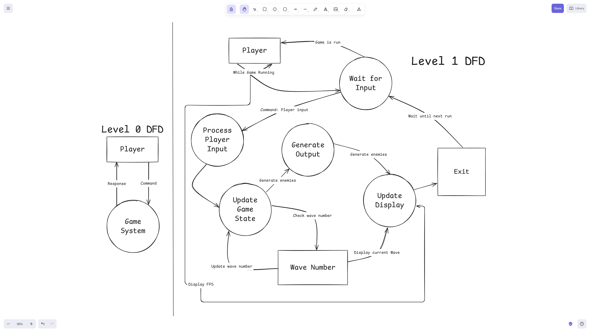

# 11ASE Task 2 - First Person Shooter Dungeon Game
#### By Victor Guo 11ASE6
# Sprint 1
## Requirements Definition
### Functional Rqeuirements
**Data Retrieval:** What does the user need to be able to view in the system?\
The user must be able to move around, shoot weapon and see objects on screen.\
**User Interface:** What is required for the user to interact with the system?\
The user needs to know the basic controls for a First-Person Shooter game. This includes W, A, S, D to move and left mouse button to shoot.\
**Data Display:** What information does the user need to obtain from the system? What needs to be output for the user?\
The user does not need to obtain anything from the system at this stage. The output for the user would be that once the user clears a wave, the next wave begins. However, this will be implemented in future sprints.

### Non-Functional Requirements
**Performance:** How well does the system need to perform?\
The system needs to be able to run at least 60 fps at any stage of gameplay. This ensures a smooth and enjoyable experience while allowing the player to have a good reaction time.\
**Reliability:** How reliable does the system and data need to be?\
The system will need to have minimal crashes due to errors, and hacks or exploits should not be able to be created.\
**Usability and Accessibility:** How easy to navigate does the system need to be? What instructions will we need for users to access the system?\
The system navigation needs to be clear and easy to grasp. This would be beneficial for the player, who will have to close the game at some point.

## Determining Specifications
### Functional Specifications
**User Requirements:** What does the user need to be able to do? List all specifications here.\
The user needs to be able to move around for this sprint. For future sprints the user will need to be also able to shoot and kill enemies.\
**Inputs & Outputs:** What inputs will the system need to accept and what outputs will it need to display?\
The system will need to accept keyboard and mouse inputs. The player will move or shoot accordingly, shown on screen.\
**Core Features:** At its core, what specifically does the program need to be able to do?\
The user needs to be able to move around the map without falling off.\
**User Interaction:** How will users interact with the system (e.g. command-line, GUI?) and what information will it need to provide to help users navigate?\
Since this program is a game the user will have a graphical interface that changes based on user input.\
**Error Handling:** What possible errors could you face that need to be handled by the system?\
User tries to change something and modifies the program, causing an error to occur. The game should either not run or not apply the changes.

### Non-Functional Specifications
**Performance:** How quickly should we try to get the system to perform tasks, what efficiency is required to maintain user engagement? How can we ensure our program remains efficient?\
The system assets should already be loaded once the game is installed. This way the program remains efficient and performs optimally.

**Useability / Accessibility:** How might you make your application more accessible? What could you do with the User Interface to improve usability?\
This program should be able to be able to run without fail after downloading all the necessary required modules straight from my GitHub page.

**Reliability:** What could perhaps not crash the whole system, but could be an issue and needs to be addressed? Data integrity? Illogical calculation? Menu navigation going to wrong places?\
The bullet should come from the gun and go straight towards the crosshair. This needs to be addressed as the player will use the crosshair to aim their shots

### Use Case
&nbsp;&nbsp; **Actor:** Player\
&nbsp;&nbsp; **Preconditions:** Player knows where the W,A,S,D keys are and how to use a mouse.\
&nbsp;&nbsp; **Main Flow:**\
&nbsp;&nbsp;&nbsp;&nbsp;&nbsp;&nbsp;&nbsp;&nbsp;&nbsp;&nbsp;&nbsp;&nbsp;&nbsp;&nbsp;&nbsp;&nbsp;1. Application Run – Player opens the application.\
&nbsp;&nbsp;&nbsp;&nbsp;&nbsp;&nbsp;&nbsp;&nbsp;&nbsp;&nbsp;&nbsp;&nbsp;&nbsp;&nbsp;&nbsp;&nbsp;2. Load Into Game – Player is able to now move on the map.\
&nbsp;&nbsp;&nbsp;&nbsp;&nbsp;&nbsp;&nbsp;&nbsp;&nbsp;&nbsp;&nbsp;&nbsp;&nbsp;&nbsp;&nbsp;&nbsp;3. Look Around Map – Player uses their mouse to look around the map smoothly.\
&nbsp;&nbsp;&nbsp;&nbsp;&nbsp;&nbsp;&nbsp;&nbsp;&nbsp;&nbsp;&nbsp;&nbsp;&nbsp;&nbsp;&nbsp;&nbsp;4. Defeat Enemies – Player defeats enemies and progresses through the waves.\
&nbsp;&nbsp; **Postconditions:** User plays game, either eliminating or failing to eliminate all enemies.

## Design
### Storyboard

Note: In my game it will display the text 'wave' instead of 'round'.
### Level 0 and 1 Data Flow Diagram

### Gantt Chart

Here is the link to the Gantt Chart for further clarity:\
https://lucid.app/lucidspark/e910e7d9-f9af-4310-921d-bc1eebee65be/edit?view_items=aDZkTitw_bmh&invitationId=inv_eea91d2c-d768-452b-84cc-376c02aacc6d

## Build and Test
```python
### From ideas.py
from ursina import *
from ursina.prefabs.first_person_controller import FirstPersonController
window.vsync = False
app = Ursina(fullscreen=True)
Sky()
player = FirstPersonController(model='cube', color=color.clear, scale_y=2, scale_x=0.5, scale_z=0.5, speed=10)
ground = Entity(model='plane', collider='box', scale=64, texture='grass', texture_scale=(4,4))

def update():
    player.x += held_keys['d'] * time.dt + time.dt
    player.x -= held_keys['a'] * time.dt + time.dt
    player.z += held_keys['w'] * time.dt + time.dt
    player.z -= held_keys['s'] * time.dt + time.dt

def jump(key):
    if key == 'space':
        player.y += 1
        invoke(setattr, player, 'y', player.y-1, delay=.25)

player.gun = None

gun = Button(parent=scene, model='gun.obj', color=color.yellow, origin_y=-.5, position=(3,0,3), collider='box', scale=(0.2,0.2,0.1))
def get_gun():
    gun.parent = camera
    gun.position = Vec3(0.2,-0.5,0.5)
    gun.rotation = (180,0,0)
    player.gun = gun
gun.on_click = get_gun

def input(key):
        if key == 'left mouse down' and player.gun:
            gun.blink(color.orange)
            bullet = Entity(parent=gun, model='cube', scale=(0.5, 0.5, 1), color=color.black)
            bullet.world_parent = scene
            bullet.animate_position(bullet.position+(bullet.forward*5000), curve=curve.linear, duration=1)
            destroy(bullet, delay=0.1)

app.run()
```
```python
### From main.py
from ursina import *
from ursina.prefabs.first_person_controller import FirstPersonController

window.vsync = False
app = Ursina(fullscreen=True)
Sky()

ground = Entity(model='plane', scale=(100,1,100), color=color.yellow.tint(-.2), texture='grass', texture_scale=(100,100), collider='box')
player = FirstPersonController(y=2, origin_y=-.5)
player.gun = None

gun = Button(parent=scene, model='gun.obj', color=color.dark_gray, origin_y=-.5, position=(0,0,0), collider='box', scale=(.2,.2,.1))
def get_gun():
    gun.parent = camera
    gun.position = Vec3(0.3,-0.5,0.5)
    player.gun = gun
gun.on_click = get_gun

def input(key):
    if key == 'left mouse down' and player.gun:
        gun.blink(color.orange)
        bullet = Entity(parent=gun, model='cube', scale=.1, color=color.black)
        bullet.world_parent = scene
        bullet.origin_y_setter(-15)
        bullet.origin_z_setter(-30)
        bullet.origin_x_setter(-10)
        bullet.animate_position(bullet.position+(bullet.forward*1000), curve=curve.linear, duration=1)
        destroy(bullet, delay=1)

app.run()
```
## Review
**Evaluate how effectively your project meets the functional and non-functional requirements defined in your planning.**\
This project meets all the fundamental requirements defined in my planning. However, the map itself could be improved on by adding walls so that the player cannot fall off regardless of how hard they try. Unfortunately, enemies were not added and will be added in future sprints as they require knowledge of classes. Overall, my current project met some of the functional and non-functional requirements, requiring the implementation of the remaining requirements in future sprints.

**Analyse the performance of your program against the key use-cases you identified.**\
The program performs well so far, although it does not have much headroom for that many more entities in terms of frame rate. I tested Fullscreen mode and this works slightly better, with more noticeable increments when increasing the resolution above 1080p (I have a 4k monitor). Without Fullscreen, it has extreme fluctuations in framerate on my monitor i.e. does not run smoothly. It does not yet meet the "defeat enemies" use case as this is to be worked on in future sprints (likely Sprints 2 and 3). Apart from these use-cases that have not yet been met, everything else has been checked off.

**Assess the quality of your code in terms of readability, structure, and maintainability.**\
Overall, my code is quite readable, being mostly straight from the Ursina FirstPersonController document. This means that it is reliable and understandable as everything is explained in their documentation on this website: https://www.ursinaengine.org/documentation.html, making it well structured and easy to maintain while being readable comprehensible.

**Explain the improvements that should be made in the next stage of development.**\
Walls, Enemies and enemy mechanics need to be added. Bullet positioning needs to be fixed, as it does not fire directly to the crosshair. Once these have been fixed, I need to investigate adding a wave system which will go hand in hand with the enemy spawning mechanics. These should be added in future sprints (Sprint 2 and 3). A bare minimum for Sprint 2 is to have enemies and walls that are displayed.

# Sprint 2
## Design
### Structure Chart

### Pseudocode
```pseudocode
BEGIN
    class Player
        controller = FirstPersonController
        IF key = scroll up THEN
            DISPLAY previous weapon
        ENDIF

        IF key = scroll down THEN
            DISPLAY next weapon
        ENDIF

        IF key held = left control THEN
            DISPLAY crouch
        ENDIF

    class Bullet
        IF key = left mouse down THEN
            DISPLAY bullet start position
            DISPLAY bullet change position
            DISPLAY bullet end position

            IF bullet hits wall OR ground THEN
                DESTROY bullet
            ENDIF
        ENDIF

    class Enemy
        follow player
END
```

### Flowchart
Note: The flow chart is based off of the functions within the player class (this mainly just outlines the FirstPersonController within Ursina).


## Build and Test
```python
from ursina import *
from ursina.prefabs.first_person_controller import FirstPersonController

window.vsync = False
app = Ursina(fullscreen=True)
Sky()

ground = Entity(model='plane', scale=(100,1,100), color=color.yellow.tint(-.2), texture='grass', texture_scale=(500,500), collider='box')
# player = FirstPersonController(y=2, origin_y=-.5)
# player.gun = None

# gun = Button(parent=scene, model='gun.obj', color=color.dark_gray, origin_y=-.5, position=(0,0,0), collider='box', scale=(.2,.2,.1))

border_one = Entity(model='cube', scale=(100, 5, 0.1), position=(50, 2.5, 0), rotation=(0,90,0), collider='box', color=color.gray)
border_two = Entity(model='cube', scale=(100, 5, 1), position=(0, 2.5, 50), roation=(0,90,0), collider='box', color=color.gray)
border_three = Entity(model='cube', scale=(1, 5, 100), position=(0, 2.5, -50), rotation=(0,90,0), collider='box', color=color.gray)
border_four = Entity(model='cube', scale=(1, 5, 100), position=(-50, 2.5, 0), rotation=(0,0,0), collider='box', color=color.gray)

class Player(Entity):
    def __init__(self, **kwargs):
        self.controller = FirstPersonController(**kwargs)
        super().__init__(parent=self.controller)

        self.gun = Entity(parent=self.controller.camera_pivot,
                               scale=0.1,
                               position=Vec3(1,-1,1.5),
                               rotation=Vec3(0,170,0),
                               model='scifi_gun.obj',
                               color=color.yellow,
                               visible= False)
        
        self.knife = Entity(parent=self.controller.camera_pivot,
                               scale=0.1,
                               position=Vec3(1,-0.5,1.5),
                               rotation=Vec3(60,-10,90),
                               model='knife.obj',
                               color=color.gray,
                               visible= False)
        
        self.weapons = [self.gun,self.knife]
        self.current_weapon = 0
        self.switch_weapon()

    def switch_weapon(self):
        for i,v in enumerate(self.weapons):
            if i == self.current_weapon:
                v.visible = True
            else:
                v.visible = False
    
    def input(self,key):
        try:
            self.current_weapon = int(key) - 1
            self.switch_weapon()
        except ValueError:
            pass

        if key == 'scroll up':
            self.current_weapon = (self.current_weapon + 1) % len(self.weapons)
            self.switch_weapon()
        
        if key == 'scroll down':
            self.current_weapon = (self.current_weapon - 1) % len(self.weapons)
            self.switch_weapon()
        
        if key == 'left mouse down' and self.current_weapon == 0:
            Bullet(model='sphere',
                   color=color.black,
                   scale=0.15,
                   position=self.controller.camera_pivot.world_position,
                   rotation=self.controller.camera_pivot.world_rotation)
        
        if key == held_keys['right mouse down'] and self.current_weapon == 0:
            camera.fov_setter = 30

        if key == 'escape':
            mouse.locked = not mouse.locked

    def update(self):
        self.controller.camera_pivot.y = 2 - held_keys['left control']

class Enemy(Entity):
    def __init__(self, position, player):
        super().__init__(model='cube', color=color.red, scale_x=(1), scale_y=(5),scale_z=(1), position=position, collider='box')
        self.speed = 2
        self.add_script(SmoothFollow(target=player.controller, speed=0.5))

class Bullet(Entity):
    def __init__(self, speed=250, lifetime=10, direction=camera.forward.normalized(),**kwargs):
        super().__init__(**kwargs)
        self.speed = speed
        self.lifetime = lifetime
        self.direction = direction
        self.origin = Vec3(-1.5,1,-1.5)
        self.start = time.time()
        self.look_at(camera.forward * 5000)
        self.world_parent = scene
    
    def update(self):
        ray = raycast(self.world_position, self.forward, distance=self.speed*time.dt)
        if not ray.hit and time.time() - self.start < self.lifetime:
            self.world_position += self.forward * self.speed * time.dt

        else:
            destroy(self)

player = Player()
enemies = [Enemy(position=(random.randint(-500, 500), 1, random.randint(-500, 500)), player=player) for _ in range(1)]

app.run()
```
## Review
**Evaluate how effectively your project meets the functional and non-functional requirements defined in your planning.**\
In this iteration the walls and enemies were added. The walls were extremely functional, as they were tall enough so that the player could not jump over. Enemies were added; however, they do not yet take damage, rather just following the player around aimlessly. The enemy spawning and wave systems will be added in future sprints due to time constraints and the fact that I am quite far behind in terms of progression. Overall, my current project met more functional and non-functional requirements than Sprint 1, however there are still requirements that I am yet to satisfy, those are to be implemented in Sprint 3.

**Analyse the performance of your program against the key use-cases you identified.**\
For the most of this sprint, I tested in Fullscreen mode and thus encountered no performance issues, handling inputs and outputs flawlessly. Unfortunately, the game still does not yet meet the "defeat enemies" use case as this is to be worked on in Sprint 3. This was because implementing classes meant that I was in reality up to Sprint 3, but I thought I was in this sprint, hence the inclusion of classes in the code. This use case is slowly being checked off, hopefully I can just work on refining and optimising the game in Sprint 4.

**Assess the quality of your code in terms of readability, structure, and maintainability.**\
Overall, my code is mostly neat and organised as it is from a YouTube tutorials by a channel called "Ursina Tutorials", making it quite high quality. This means that in the future I can easily identify where an error may lie. This makes it suitable for future iterations/sprints. One thing that I am yet to add to the script is comments and potentially docstrings so that my code can be more widely understood. These will be added in Sprint 3.

**Explain the improvements that should be made in the next stage of development.**\
Now that the bullet positioning has been fixed, and walls and enemies have been implemented, all that is left is to implement their mechanics. The player health mechanics need to be added too, so that the game can fully function with some degree of sophistication. Once these have been completed, I need to look into adding a wave system, death screen, main menu, and enemy textures/models (this will be added in Sprint 4 on top of the full functionality), adding most of these in Sprint 3.

# Sprint 3
## Design
### UML Class Diagram

## Build and Test
```python
from ursina import *
from ursina.prefabs.first_person_controller import FirstPersonController
from ursina.prefabs.health_bar import HealthBar

window.vsync = False
app= Ursina(borderless=False)
Sky()

class Player(Entity):
    def __init__(self, **kwargs):
        self.controller = FirstPersonController(**kwargs)
        super().__init__(parent=self.controller)
        self.collider = CapsuleCollider(self, center=Vec3(0.5,2.5,0.5), height=5, radius=0.25)
        self.health = 100
        self.health_bar = HealthBar(bar_color=color.lime.tint(-.25), roundness=0.5, max_value=100, value=self.health, scale=(.25,.02), position=(-0.85,-0.45))

        self.gun = Entity(parent=self.controller.camera_pivot,
                               scale=0.1,
                               position=Vec3(1,-1,1.5),
                               rotation=Vec3(0,170,0),
                               model='scifi_gun.obj',
                               color=color.yellow,
                               visible= False)
        
        self.knife = Entity(parent=self.controller.camera_pivot,
                               scale=0.1,
                               position=Vec3(1,-0.5,1.5),
                               rotation=Vec3(60,-10,90),
                               model='knife.obj',
                               color=color.gray,
                               visible= False)
        
        self.weapons = [self.gun,self.knife]
        self.current_weapon = 0
        self.switch_weapon()

    def switch_weapon(self):
        for i,v in enumerate(self.weapons):
            if i == self.current_weapon:
                v.visible = True
            else:
                v.visible = False
    
    def input(self,key):
        try:
            self.current_weapon = int(key) - 1
            self.switch_weapon()
        except ValueError:
            pass

        if key == 'scroll up':
            self.current_weapon = (self.current_weapon + 1) % len(self.weapons)
            self.switch_weapon()
        
        if key == 'scroll down':
            self.current_weapon = (self.current_weapon - 1) % len(self.weapons)
            self.switch_weapon()
        
        if key == 'left mouse down' and self.current_weapon == 0:
            Bullet(model='sphere',
                   color=color.black,
                   scale=0.15,
                   position=self.controller.camera_pivot.world_position,
                   rotation=self.controller.camera_pivot.world_rotation)
        
        if key == 'right mouse down' and self.current_weapon == 0:
            camera.fov = 30
        elif key == 'right mouse up' and self.current_weapon == 0:
            camera.fov = 90

        if key == 'left mouse down' and self.current_weapon == 1:  # Knife is weapon 1
            self.slash()

        if key == 'escape':
            mouse.locked = not mouse.locked

    def update(self):
        self.controller.camera_pivot.y = 2 - held_keys['left control']

    def slash(self):
        if not hasattr(self, 'knife_cooldown'):
            self.knife_cooldown = 0
        if time.time() - self.knife_cooldown < 0.5:
            return  # Cooldown between slashes

        self.knife_cooldown = time.time()

    # Basic forward slash animation (optional visual)
        knife = self.knife
        knife.animate_rotation(Vec3(60, -10, 90) + Vec3(-90, 0, 0), duration=0.1)
        knife.animate_rotation(Vec3(60, -10, 90), duration=0.1, delay=0.1)

    # Melee hit detection
        hit = raycast(self.controller.camera_pivot.world_position, self.controller.forward, distance=2)
        if hit.hit:
            print(f"Knife hit: {hit.entity}")

            if hasattr(hit.entity, 'health'):
                hit.entity.health -= 75  # Big damage for melee
                print(f"Enemy health: {hit.entity.health}")

                if hit.entity.health <= 0:
                    destroy(hit.entity)

class Bullet(Entity):
    def __init__(self, speed=250, lifetime=10, direction=camera.forward.normalized(),**kwargs):
        super().__init__(**kwargs)
        self.speed = speed
        self.lifetime = lifetime
        self.direction = direction
        self.origin = Vec3(-1.5,1,0)
        self.start = time.time()
        self.look_at(camera.forward * 5000)
        self.world_parent = scene
    
    def update(self):
        ray = raycast(self.world_position, self.forward, distance=self.speed*time.dt)
        if not ray.hit and time.time() - self.start < self.lifetime:
            self.world_position += self.forward * self.speed * time.dt

        if ray.hit:
            if hasattr(ray.entity, 'is_enemy') and ray.entity.is_enemy:
                ray.entity.health -= 50
                print(f"Enemy hit! Health: {ray.entity.health}")
            if ray.entity.health <= 0:
                destroy(ray.entity)
            destroy(self)

class Enemy(Entity):
    def __init__(self, position, player, health=150, damage=10):
        super().__init__(model='cube', color=color.blue, scale_x=1, scale_y=5, scale_z=1, position=position, collider='box')
        self.speed = 2
        self.is_enemy = True
        self.health = health
        self.player = player
        self.damage = damage  # Make the player recogniseable
        self.add_script(SmoothFollow(target=player.controller, speed=0.5))
        self.damage_cooldown = 1.0  # seconds between hits
        self.time_since_last_hit = 0.0
        self.collider = BoxCollider(self, center=Vec3(0.25,1.25,0.25), size=Vec3(1,5,1))
    
    def prevent_merging(self):
        for other in enemy_list:
            if other == self:
                continue
            if self.intersects(other).hit:
                # Push the enemy away slightly
                push_dir = (self.position - other.position).normalized()
                self.position += push_dir * time.dt * 5  # Tune this push strength

    def update(self):
        self.time_since_last_hit += time.dt
        self.prevent_merging()

        # Check distance to player instead of collider comparison
        if distance(self.world_position, self.player.world_position) < 2:
            if self.time_since_last_hit >= self.damage_cooldown:
                self.player.health -= self.damage
                self.player.health_bar.value = self.player.health
                print(f'Player Health: {self.player.health}')
                self.time_since_last_hit = 0

                if self.player.health <= 0:
                    self.player.health = 0
                    print("player died")
                    death_screen = Text(text='YOU DIED', color=color.red, position=(0,0), scale=9, origin=(0,0), background=True)
    
    def spawn_wave():
        global enemy_list, round_number, wave_cleared

        print(f"Spawning wave {round_number}")
        enemy_list = []
        wave_cleared = False

        for _ in range(round_number * 2):  # Increase number of enemies each wave
            pos = Vec3(random.uniform(-40, 40), 1, random.uniform(-40, 40))
            enemy = Enemy(position=pos, player=player)
            enemy_list.append(enemy)

        wave_text.text = f'Wave: {round_number}'

    def system():
        if not game_started:
            return  # Don't run the game until user presses Play

        global wave_cleared

        player.update()
        # Update enemies
        for bullet in scene.entities:
            if isinstance(bullet, Bullet):
                bullet.update()

        for enemy in enemy_list[:]:  # Copy the list to avoid iteration issues
            if enemy.health <= 0:
                destroy(enemy)
                enemy_list.remove(enemy)

        # Check for end of wave
        if len(enemy_list) == 0 and not wave_cleared and player.health >0 :
            wave_cleared = True
            invoke(start_next_wave, delay=3)  # Delay before next wave

    def start_next_wave():
        global round_number
        if round_number < 10:
            round_number += 1
            spawn_wave()
        if round_number == 10:
            print("yay")


                    
class Map(Entity):
    def __init__(self, **kwargs):
        super().__init__(**kwargs)
        self.health = float('inf')  # Infinite health
        self.is_map = True  # Tag to identify map objects

player = Player()

ground = Map(model='plane', scale=(100,1,100), color=color.yellow.tint(-.2), texture='grass', texture_scale=(500,500), collider='box')
border_one = Map(model='cube', scale=(100, 5, 0.1), position=(50, 2.5, 0), rotation=(0,90,0), collider='box', texture='grass')
border_two = Map(model='cube', scale=(100, 5, 1), position=(0, 2.5, 50), rotation=(0,0,0), collider='box', texture='grass')
border_three = Map(model='cube', scale=(1, 5, 100), position=(0, 2.5, -50), rotation=(0,90,0), collider='box', texture='grass')
border_four = Map(model='cube', scale=(1, 5, 100), position=(-50, 2.5, 0), rotation=(0,0,0), collider='box', texture='grass')

game_started = False

round_number = 0
enemy_list = []
wave_cleared = False

def title_screen():
    # Title Text
    title_text = Text(text="Sahur Shooter", color=color.white, scale=3, origin=(0,0), y=0.35, z=0.1, background=True)

    # Play Button
    play_button = Button(text='Play', color=color.green, scale=(0.3, 0.1), y=-0.2)
    
    # Quit Button
    quit_button = Button(text='Quit', color=color.red, scale=(0.3, 0.1), y=-0.4)

    # Background UI
    title_bg = Entity(parent=camera.ui, model='quad', scale=(2,1), color=color.black, z=1)

    mouse.locked = False
    camera.fov = 90
    camera.position = (0, 0, -20)  # Optional: move camera away from gameplay view
    camera.rotation = (0, 0, 0)

    def start_game():
        global game_started, play_again

        title_bg.disable()
        title_text.disable()
        play_button.disable()
        quit_button.disable()
        game_started = True
        mouse.locked = True
        camera.position = (0,0,0)
        update()

    def quit_game():
        app.userExit()

    play_button.on_click = start_game
    quit_button.on_click = quit_game

wave_text = Text(text=f'Wave: {round_number}', position=(-0, 0.45), scale=1, origin=(0,0), background=True)

def spawn_wave():
    global enemy_list, round_number, wave_cleared

    print(f"Spawning wave {round_number}")
    enemy_list = []
    wave_cleared = False

    for _ in range(round_number * 2):  # Increase number of enemies each wave
        pos = Vec3(random.uniform(-40, 40), 1, random.uniform(-40, 40))
        enemy = Enemy(position=pos, player=player)
        enemy_list.append(enemy)

    wave_text.text = f'Wave: {round_number}'

def update():
    if not game_started:
        return  # Don't run the game until user presses Play

    global wave_cleared

    player.update()
        # Update enemies
    for bullet in scene.entities:
        if isinstance(bullet, Bullet):
            bullet.update()

    for enemy in enemy_list[:]:  # Copy the list to avoid iteration issues
        if enemy.health <= 0:
            destroy(enemy)
            enemy_list.remove(enemy)

        # Check for end of wave
    if len(enemy_list) == 0 and not wave_cleared and player.health >0 :
        wave_cleared = True
        invoke(start_next_wave, delay=3)  # Delay before next wave

def start_next_wave():
    global round_number
    if round_number < 10:
        round_number += 1
        spawn_wave()
    if round_number == 10:
        print("yay")

title_screen()
app.run()
```
## Review
**Evaluate how effectively your project meets the functional and non-functional requirements defined in your planning.**\
This project now meets all but one of the functional and non-functional requirements that I have defined in my planning. One thing to note is that the death screen is repeatedly spawned, leading to low framerates and worsening the performance to the point that it is extremely difficult to close out or the game as intended. This means that I can extend myself in sprint 4 and enhance the user experience without a sacrifice in performance. I will add a boss wave and screens for when the player beats it. I will also make sure that they do not infinitely spawn, thus increasing the performance of aforementioned aspects.

**Analyse the performance of your program against the key use-cases you identified.**\
The program performs slightly worse than on Sprint 2, however, this is just because there are more entities in the game, making it more developed. Every aspect of the game works as intended, so in that light the game does fully meet all the use-case requirements previously identified. All performance issue will be fixed in Sprint 4, so that the user enjoys a smooth experience while clearing waves.

**Assess the quality of your code in terms of readability, structure, and maintainability.**\
Now that I have added my own classes and functions, my code is still readable but is slightly more difficult to understand due to the lack of comments. This means that in the future I would really need to understand the code in order to make improvements. In the next sprint I will make the code understandable to more people, this way they can also modify the game and even improve on it. 

**Explain the improvements that should be made in the next stage of development.**\
Enemy textures and models, more walls should be added to the map so that is more challenging to navigate. The game should also have more enemies; two on the first wave is too easy. Also, the game should have a boss wave and screens for when the player beats it, as mentioned before. Another thing to make sure is that the enemies cannot spawn in the walls and they cannot clip through them either. I will be implementing these in the final sprint.

# Sprint 4
## Design
### Updated UML Class Diagram

## Build and Test
```python
# Thanks to Ursina Tutorials on YouTube for most of the Player Class
from ursina import *
from ursina.prefabs.first_person_controller import FirstPersonController
from ursina.prefabs.health_bar import HealthBar
import random
import time
import os 

window.vsync = False 
app = Ursina(borderless=False)
sky = Sky(texture='assets/sky')

game_started = False  # Flag to check if the game has started
round_number = 0  # Current wave/round number
enemy_list = []  # List to store all enemy entities
wave_cleared = False  # Flag to check if the current wave is cleared

class Player(Entity):
    def __init__(self, **kwargs): 
        self.controller = FirstPersonController(**kwargs) # Set player controller to FirstPersonController
        super().__init__(parent=self.controller)  
        self.collider = CapsuleCollider(self, center=Vec3(0.5,2.5,0.5), height=5, radius=0.25) 
        self.health = 100 
        self.health_bar = HealthBar(bar_color=color.lime.tint(-.25), roundness=0.5, max_value=100, value=self.health, scale=(.25,.02), position=(-0.85,-0.45))

        self.gun = Entity(parent=self.controller.camera_pivot,
                               scale=0.1,
                               position=Vec3(1,-1,1.5),
                               rotation=Vec3(0,170,0),
                               model='assets/scifi_gun.obj',
                               color=color.yellow,
                               visible=False)
        
        self.knife = Entity(parent=self.controller.camera_pivot,
                               scale=0.1,
                               position=Vec3(1,-0.5,1.5),
                               rotation=Vec3(60,-10,90),
                               model='assets/knife.obj',
                               color=color.gray,
                               visible=False)
        
        self.weapons = [self.gun, self.knife]
        self.current_weapon = 0 
        self.switch_weapon()

    def switch_weapon(self): 
        for i, v in enumerate(self.weapons):  
            v.visible = (i == self.current_weapon)  # Only show current weapon

    def input(self, key):  # Handle input events
        global paused  # Use global paused flag
        if key == 'escape':
            if not ('win_screen_shown' in globals() and win_screen_shown):  # Only show pause on right conditions
                toggle_pause()
            return
        if paused:  # Ignore player input while paused
            return
        
        try:
            self.current_weapon = int(key) - 1  # Weapon selection system
            self.switch_weapon()
        except ValueError:
            return  # Ensures accurate switching

        if key == 'scroll up':  # Mouse scroll up
            self.current_weapon = (self.current_weapon + 1) % len(self.weapons)  # Next weapon
            self.switch_weapon()
        
        if key == 'scroll down':  # Mouse scroll down
            self.current_weapon = (self.current_weapon - 1) % len(self.weapons)  # Previous weapon
            self.switch_weapon()
        
        if key == 'left mouse down' and self.current_weapon == 0:  # Shoot gun
            Bullet(model='sphere',
                   color=color.black,
                   scale=0.1,
                   position=self.controller.camera_pivot.world_position,
                   rotation=self.controller.camera_pivot.world_rotation)
        
        if key == 'right mouse down' and self.current_weapon == 0:  # Aim down sights
            camera.fov = 30
        elif key == 'right mouse up' and self.current_weapon == 0:  # Stop aiming
            camera.fov = 90

        if key == 'left mouse down' and self.current_weapon == 1:  # Knife attack
            self.slash()

    def update(self):  # Player Update
        if held_keys['shift']:
            self.controller.speed = 25 
        else:
            self.controller.speed = 5
        self.controller.camera_pivot.y = 2 - held_keys['left control']  # Crouch if control key held

    def slash(self):  # Knife attack logic
        if not hasattr(self, 'knife_cooldown'):
            self.knife_cooldown = 0  # Initialize cooldown
        if time.time() - self.knife_cooldown < 0.5:  # Cooldown check
            return  # Cooldown between slashes

        self.knife_cooldown = time.time()  # Reset cooldown

        # Animate slash
        knife = self.knife  # Get knife entity
        knife.animate_rotation(Vec3(60, -10, 90) + Vec3(-90, 0, 0), duration=0.1) 
        knife.animate_rotation(Vec3(60, -10, 90), duration=0.1, delay=0.1)  # Reset rotation

        # Melee hit detection
        hit = raycast(self.controller.camera_pivot.world_position, self.controller.forward, distance=2)  # Raycast for hit
        if hit.hit:  # If hit something
            if hasattr(hit.entity, 'health'):  # If entity has health
                hit.entity.health -= 150  # One shot normal enemies
                # Update boss health bar immediately if boss
                if hasattr(hit.entity, 'is_boss') and hit.entity.is_boss:
                    global boss_health_bar
                    if boss_health_bar:
                        boss_health_bar.value = hit.entity.health

                if hit.entity.health <= 0:  # If enemy dead
                    destroy(hit.entity)  # Destroy enemy
                    
class Bullet(Entity): 
    def __init__(self, speed=500, lifetime=0.5, direction=camera.forward.normalized(), **kwargs):
        super().__init__(**kwargs) 
        self.speed = speed  
        self.lifetime = lifetime 
        self.direction = direction  
        self.origin = Vec3(-1.5,1,0) 
        self.start = time.time()
        self.look_at(camera.forward * 5000)
        self.world_parent = scene
    
    def update(self): 
        if 'paused' in globals() and paused:  # Set no bullets shot when paused
            return
        ray = raycast(self.world_position, self.forward, distance=self.speed*time.dt) 
        if not ray.hit and time.time() - self.start < self.lifetime:  # If bullet not hit anything and not expired
            self.world_position += self.forward * self.speed * time.dt 
        
        if time.time() - self.start >= self.lifetime: # Remove bullet when past lifetime
            destroy(self)

        if ray.hit: 
            if hasattr(ray.entity, 'is_enemy') and ray.entity.is_enemy:  # If bullet hits enemy
                ray.entity.health -= 50  # Three shot enemies, this was there is some difficulty
                print(f"Enemy Health: {ray.entity.health}")
                # Update boss health bar immediately when boss hit (identified using the is_boss classification)
                if hasattr(ray.entity, 'is_boss') and ray.entity.is_boss:
                    global boss_health_bar
                    if boss_health_bar:
                        boss_health_bar.value = ray.entity.health
            if hasattr(ray.entity, 'health') and ray.entity.health <= 0:  # If any enemy class dead
                destroy(ray.entity)
            destroy(self)

class Enemy(Entity):
    def __init__(self, position, target, health=150, damage=5):
        super().__init__(model='assets/sahur.obj', texture='assets/sahur_skin.png', scale=1, position=position, collider='box')  # Set enemy appearance
        self.speed = 5
        self.is_enemy = True  # Classification as enemy
        self.health = health 
        self.target = player  # Set the target as the player
        self.damage = damage
        # self.add_script(SmoothFollow(target=player.controller, speed=0.5))  # Smooth follow script, originally used this
        self.damage_cooldown = 1.0  # Seconds between hits, so that damage is consistent
        self.time_since_last_hit = 0.0  # Time since last hit, again, ensuring damage is consistent
        self.collider = BoxCollider(self, center=Vec3(0.25,1.25,0.25), size=Vec3(1,5,1))

        # Make sure enemy spawn is not in wall, try spawning again if that is the case
        max_attempts = 20
        attempts = 0
        while True:
            collides = False
            for entity in scene.entities:
                if hasattr(entity, 'is_map') and entity.is_map and entity != ground:
                    if self.intersects(entity).hit:
                        collides = True
                        break
            if not collides:
                break
            # Try spawning on a new random position on the map
            self.position = Vec3(random.uniform(-40, 40), 1, random.uniform(-40, 40))
            attempts += 1
            if attempts >= max_attempts:
                break  # Stop spawning after too many attempts to spawn
    
    def prevent_merging(self):  # Prevent enemies from merging into one
        for other in enemy_list:  # Loop through all enemies
            if other == self:
                continue
            if self.intersects(other).hit:  # If colliding with another enemy
                # Push the enemy away slightly
                push_dir = (self.position - other.position).normalized()  # Direction to push
                self.position += push_dir * time.dt * 5  # Setting new position after begin pushed

    def update(self):
        global paused  # Use global paused flag
        if 'paused' in globals() and paused: 
            return
        # Prevent enemy from going under the ground
        if self.y < 1:
            self.y = 1
        # Rotate enemy to face player
        direction = self.player.world_position - self.world_position  # Direction to player from enemy (self)
        direction.y = 0  # Make it so the rotation is only on the ground
        target_angle = math.degrees(math.atan2(direction.x, direction.z))  # Calculate target angle using trigonometry
        self.rotation_y = lerp(self.rotation_y, target_angle, 6 * time.dt)  # Rotate towards player

        # Enemy movement to avoid walls
        move_directions = [0, 45, -45, 90, -90]  # Try common angles 
        moved = False # Tells the game that enemy has not moved towards player yet
        for angle in move_directions:
            # Rotate direction by angle
            rad = math.radians(angle) # Use radians to calculate angle
            dir_vec = Vec3(
                direction.x * math.cos(rad) - direction.z * math.sin(rad),
                0,
                direction.x * math.sin(rad) + direction.z * math.cos(rad)
            ).normalized()
            move_step = dir_vec * self.speed * time.dt
            new_position = self.world_position + move_step
            blocked = False
            for entity in scene.entities:
                if hasattr(entity, 'is_map') and entity.is_map and entity != ground:
                    old_pos = self.world_position
                    self.world_position = new_position
                    if self.intersects(entity).hit:
                        blocked = True
                        self.world_position = old_pos
                        break
                    self.world_position = old_pos
            if not blocked:
                self.world_position = new_position
                moved = True
                break
        # If all directions blocked, don't move

        self.time_since_last_hit += time.dt  # Update hit timer
        self.prevent_merging()  # Prevent merging

        # Check distance to player instead of collider comparison
        if distance(self.world_position, self.player.world_position) < 2:  # If close to player
            if self.time_since_last_hit >= self.damage_cooldown:  # If cooldown passed
                self.player.health -= self.damage  # Damage player
                self.player.health_bar.value = self.player.health  # Update health bar
                print(f'Player Health: {self.player.health}')  # Print health
                self.time_since_last_hit = 0  # Reset hit timer

                if self.player.health <= 0:  # If player dead
                    self.player.health = 0
                    print("player died")
                    death_screen = Text(text='YOU DIED', color=color.red, position=(0,0), scale=9, origin=(0,0), background=True, z=0)  # Show death screen
                    death_bg = Entity(parent=camera.ui, model='quad', scale=(2,1), color=color.black, z=1)  # Show background
                    # Hide use pause screen but don't display pause text
                    player.health_bar.disable()
                    wave_text.disable()
                    enemies_left_text.disable()
                    paused = True
                    set_enemy_follow_enabled(False)
                    player.controller.enabled = False
                    mouse.locked = False

boss_health_bar = None  # Boss health bar global variable
class Boss(Enemy):
    def __init__(self, position, player): 
        super().__init__(position=position, player=player, health=1000, damage=30) 
        self.model = 'assets/sahur.obj'  
        self.texture = 'assets/sahur_skin.png' 
        self.scale = 5 # Make the boss bigger than the enemies
        self.is_boss = True  # Classification, same as for Enemy
        global boss_health_bar
        boss_health_bar = HealthBar(bar_color=color.red, roundness=0.5, max_value=10000, value=1000, scale=(1,0.01), position=(-0.50,0.40))  # Boss health bar

    def update(self):
        if 'paused' in globals() and paused:
            return
        # Prevent boss from going under the ground
        if self.y < 1:
            self.y = 1
        # Do the same thing as the enemy, there is no enemy variable yet
        direction = self.player.world_position - self.world_position
        direction.y = 0 
        target_angle = math.degrees(math.atan2(direction.x, direction.z)) 
        self.rotation_y = lerp(self.rotation_y, target_angle, 6 * time.dt)
        super().update()
        global boss_health_bar
        if boss_health_bar:
            boss_health_bar.value = self.health  # Set the boss health bar to display its health
        if self.health <= 0 and boss_health_bar: 
            boss_health_bar.disable()  # Hide health bar when boss dies
            boss_health_bar = None

class Map(Entity):
    def __init__(self, **kwargs): 
        if 'texture' not in kwargs:
            kwargs['texture'] = 'assets/tung_wall.png'  # Set defaults for Map entities
        if 'model' not in kwargs:
            kwargs['model'] = 'cube'
        if 'collider' not in kwargs:
            kwargs['collider'] = 'box'
        super().__init__(**kwargs)
        self.health = float('inf')  # Set infinite health
        self.is_map = True  # Classification, same as for Enemy

player = Player()  # Create player

# Hide health bar and wave text at start
player.health_bar.disable()  # Hide health bar

ground = Map(model='plane', scale=(100,1,100), color=color.yellow.tint(-.2), texture='assets/sahur_ground.png'texture_scale=(1,1))  # Ground entity
border_one = Map(scale=(100, 5, 0.1), position=(50, 2.5, 0), rotation=(0,90,0))  # Border 1
border_two = Map(scale=(100, 5, 1), position=(0, 2.5, 50), rotation=(0,0,0))  # Border 2
border_three = Map(scale=(1, 5, 100), position=(0, 2.5, -50), rotation=(0,90,0))  # Border 3
border_four = Map(scale=(1, 5, 100), position=(-50, 2.5, 0), rotation=(0,0,0))  # Border 4

# L-shaped walls for symmetry (yes, symmetry is necessary)
num_layers = 1  # Set the number of times to spawn walls inward
layer_gap = 10
min_length = 14  # Minimum and maximum wall lengths, so the game can make them have similar gap size between them
max_length = 34 
wall_thickness = 1
for i in range(num_layers):
    # Proportional wall length based on distance from center, so the wall edges align evenly
    t = (num_layers - 1 - i) / (num_layers - 1) if num_layers > 1 else 1
    wall_length = min_length + (max_length - min_length) * t
    offset = layer_gap * (i + 1) + wall_thickness * i
    # Top-left corner
    tl_x = -50 + offset + wall_thickness/2
    tl_z = 50 - offset - wall_length/2
    Map(scale=(1, 5, wall_length), position=(tl_x, 2.5, tl_z))  # The position of the outermost vertical and horizontal walls is fixed
    Map(scale=(wall_length, 5, 1), position=(-50 + offset + wall_length/2, 2.5, 50 - offset - wall_thickness/2))
    # Top-right corner
    tr_x = 50 - offset - wall_thickness/2
    tr_z = 50 - offset - wall_length/2
    Map(scale=(1, 5, wall_length), position=(tr_x, 2.5, tr_z))
    Map(scale=(wall_length, 5, 1), position=(50 - offset - wall_length/2, 2.5, 50 - offset - wall_thickness/2))
    # Bottom-left corner
    bl_x = -50 + offset + wall_thickness/2
    bl_z = -50 + offset + wall_length/2
    Map(scale=(1, 5, wall_length), position=(bl_x, 2.5, bl_z))
    Map(scale=(wall_length, 5, 1), position=(-50 + offset + wall_length/2, 2.5, -50 + offset + wall_thickness/2))
    # Bottom-right corner
    br_x = 50 - offset - wall_thickness/2
    br_z = -50 + offset + wall_length/2
    Map(scale=(1, 5, wall_length), position=(br_x, 2.5, br_z))
    Map(scale=(wall_length, 5, 1), position=(50 - offset - wall_length/2, 2.5, -50 + offset + wall_thickness/2))

    
wave_text = Text(text=f'Wave: {round_number}', position=(-0, 0.45), scale=1, origin=(0,0), background=True)  # Wave text UI
wake_text_disabled = True  # State to make wave text disabled when not needed.
wave_text.disable() 

# Enemies left text UI
enemies_left_text = Text(text=f'Enemies Left: 0', position=(0.65, 0.45), scale=1, origin=(0,0), background=True)
enemies_left_text.disable()

def spawn_wave():  # Spawn a new wave of enemies
    global enemy_list, round_number, wave_cleared, boss_health_bar

    enemy_list = []  # Clear enemy list at the start of a new wave
    wave_cleared = False  # Wave state is reset (wave is not cleared)

    if round_number == 10:
        # Spawn only the boss
        pos = Vec3(0, 1, 0)
        boss = Boss(position=pos, player=player)  # Create boss enemy
        enemy_list.append(boss)  # Add boss to enemy list (a boss in an enemy)
    else:
        for _ in range(4 * round_number):  # Set the munber of enemies per wave to four times the wave number
            pos = Vec3(random.uniform(-40, 40), 1, random.uniform(-40, 40))  # Random enemy spawn position
            enemy = Enemy(position=pos, player=player)  # Create enemy
            enemy_list.append(enemy)  # Add enemy to list

    if 'paused' in globals() and paused:
        set_enemy_follow_enabled(False)  # Disable the enemy following the player when paused

    wave_text.text = f'Wave: {round_number}'  # Update wave text each wave

def update():
    global paused, wave_cleared, win_screen_shown
    if not game_started:
        return  # User must press Play button to start game

    if paused: 
        return

    # Update enemies left text
    enemies_left_text.text = f'Enemies Left: {len(enemy_list)}'
    if not wake_text_disabled:
        enemies_left_text.enable()
    else:
        enemies_left_text.disable()

    # Win screen logic
    if 'win_screen_shown' in globals() and win_screen_shown:
        return

    player.update()  # Update player
    # Update bullets
    for bullet in scene.entities:
        if isinstance(bullet, Bullet):
            bullet.update()  # Update bullet

    for enemy in enemy_list[:]:  # Copy the list to avoid iteration issues
        if enemy.health <= 0:  # If enemy dead
            # Hide boss health bar if boss is defeated
            if hasattr(enemy, 'is_boss') and enemy.is_boss:
                global boss_health_bar
                if boss_health_bar:
                    boss_health_bar.disable()
                    boss_health_bar = None
            destroy(enemy)  # Destroy enemy
            enemy_list.remove(enemy)  # Remove from list

    if round_number == 10 and len(enemy_list) == 0 and player.health > 0:
        win_screen_shown = True  # Show win screen if this is 'True'
        win_text = Text(text='YOU WIN!', color=color.lime, position=(0,0), scale=9, origin=(0,0), background=True, z=0, parent=camera.ui)  # Win text
        win_bg = Entity(parent=camera.ui, model='quad', scale=(2,1), color=color.black, z=1)  # Win background=
        mouse.locked = False  # Unlock mouse
        paused = True  # Pause game
        player.controller.enabled = False  # Disable player
        def wait_for_exit(key):  # Wait for exit input
            if key == 'escape' or key == 'enter':
                app.userExit()
        win_text.input = wait_for_exit  # Set input handler
        # congrats.input = wait_for_exit
        window.input = wait_for_exit
        return

    # Check for end of wave
    if len(enemy_list) == 0 and not wave_cleared and player.health > 0:
        wave_cleared = True  # Set wave cleared
        invoke(start_next_wave, delay=3)  # Delay before next wave

def start_next_wave():  # Start the next wave
    global round_number
    if round_number < 10:
        round_number += 1  # Increment round
        spawn_wave()  # Spawn new wave
    if round_number == 10:
        print("yay")  # Print yay on boss wave

def title_screen():  # Show title screen
    # Title Text
    title_text = Text(text="Sahur Shooter", color=color.white, scale=5, origin=(0,0), y=0.1, z=0.1, background=True)
    # Play button
    play_button = Button(text='Play', color=color.green, scale=(0.3, 0.1), x=-0.175, y=-0.25)
    # Quit button
    quit_button = Button(text='Quit', color=color.red, scale=(0.3, 0.1), x=0.175, y=-0.25)
    # Title background (the image did not work)
    title_bg = Entity(parent=camera.ui, model='quad', scale=(2,1), color=color.black, z=1)

    mouse.locked = False
    camera.fov = 90
    camera.position = (0, 0, -20)  # Move camera away from gameplay view so the player can't see the map beforehand
    camera.rotation = (0, 0, 0)  # Set camera rotation

    def start_game():  # Start game handler
        global game_started, wake_text_disabled

        title_bg.disable()
        title_text.disable()
        play_button.disable()
        quit_button.disable()
        game_started = True
        mouse.locked = True
        camera.position = (0,0,0) # Set campera position to first person pos
        player.health_bar.enable() 
        wave_text.enable()
        wake_text_disabled = False
        update()

    def quit_game(): 
        app.userExit()

    play_button.on_click = start_game 
    quit_button.on_click = quit_game

paused = False  # Indicate to the game that it is not paused.
pause_entities = []  # List of entities used in the Pause screen
def set_enemy_follow_enabled(enabled):  # Enable/disable enemy following
    for enemy in enemy_list:
        for script in enemy.scripts:
            if isinstance(script, SmoothFollow):
                script.enabled = enabled

def toggle_pause():
    global paused, pause_entities
    if 'win_screen_shown' in globals() and win_screen_shown:
        return
    paused = not paused  # Toggle paused flag
    set_enemy_follow_enabled(not paused)  # Enable/disable enemy following
    # Freeze/unfreeze player movement by disabling/enabling FirstPersonController
    player.controller.enabled = not paused
    if paused:
        mouse.locked = False  # Unlock mouse
        pause_bg = Entity(parent=camera.ui, model='quad', scale=(2,1), color=color.black, z=2)  # Pause background
        pause_text = Text(text='PAUSED', color=color.azure, scale=4, origin=(0,0), y=0.1, z=2, background=True)  # Pause text
        resume_button = Button(text='Resume', color=color.green, scale=(0.3, 0.1), y=-0.1, z=2)  # Resume button
        quit_button = Button(text='Quit', color=color.red, scale=(0.3, 0.1), y=-0.25, z=2)  # Quit button
        def resume():
            toggle_pause()
        def quit_game():
            app.userExit()
        resume_button.on_click = resume 
        quit_button.on_click = quit_game
        pause_entities = [pause_bg, pause_text, resume_button, quit_button]
    else:
        for e in pause_entities:
            e.disable()
        pause_entities = [] 
        mouse.locked = True 

title_screen()  # Show title screen
app.run() 
```
Note: The textures don't work until I move the python file to 11ASE_Task-2 (so there is no folders). This applies to all Sprints. Please test using 'testing.py'.
## Launch
The game will be available in a .exe file. To run this on a non-Windows operating system, you can download Wine in order to run .exe files.

## Review
**Evaluate how effectively your project meets the functional and non-functional requirements defined in your planning.**\
This project now meets all but one of the functional and non-functional requirements that I have defined in my planning. The wave spawning mechanism is not yet perfect, but it works, and due to poor time management, I was not able to improve on it. The 3D models are not ideal due to being copied from a model downloading site, but they serve the purpose in my game. The overall game is responsive, and the player can move around the map without any issues. However, there are a few issues with performance that I will see if I can address in the future.

**Analyse the performance of your program against the key use-cases you identified.**\
Overall, the program satisfies all the use cases that I have defined in the first sprint. The game is responsive, and the player can move around the map without any issues. However, there are a few issues when it comes to spawning the enemies in such manner. Due to the enemies being Entities, the more of them on the map, the lower the frame rate. I am still in need of a way to spawn enemies more efficiently. In the future, I will optimise the game and improve the map and enemy system.

**Assess the quality of your code in terms of readability, structure, and maintainability.**\
With the comments in my code, it is clear what most lines are trying to achieve. This is useful as it means that anyone can try and improve my game by modifying the code. When doing so, they will know exactly where to implement their modifications and what the program will do. In the future, I hope to make all the classes in separate files, but due to time constraints, I was not able to do as such.

**Explain the improvements that should be made in the next stage of development.**\
Now that I have created a game, the next stage is to make it run better. I will continue to maintain and improve on the game, rolling out updates on my personal repository PythonCode, where all my personal python files are. I will aim to optimise the game first, then adding more weapons and if I can, maybe even a multiplayer mode. 

## Evaluation of System
**1. Explain how you could improve your system in future updates. Analyse the impact these updates could have on the user experience.**\
As a poorly time managed game project, I could improve my program by adding extra features such as animations and making optimisations to improve my framerate. The framerate is an important aspect of a First Person Shooter (FPS) game as a higher framerate means that the game runs smoother and reduces delay and improves game physics. Improving the game's performance by enhancing the wave system will also make it more responsive and enjoyable for the player due to getting a smoother experience. Additionally, I could add more weapons to the game that will be placed around the map (these can and are to be picked up by the player), which would make the game more engaging for the player, although this would be essentially useless due to the player getting a similar experience with each weapon. I could also add a multiplayer mode to the game, which would allow players to compete against each other, similar to games like Valorant, Counter Strike and Apex Legends. This allows for a more sophisticated experience than the one provided by my current version of the game, however, increases competitiveness and could end up with more unhappy players than happy ones.

**2. Evaluate the system in terms of how well it meets the requirements and specifications.**\
The system meets the requirements and specifications of the project, even exceeding the expectations by adding textures to the map and sky. It satisfies most of the requirements extremely well, there are just some issues relating to performance, specifically, the enemy spawning system. The game will freeze just before spawning the first wave, which can be an issue as the player is not able to get a fair start at the game due to not being able to run away from the enemies if they spawned on top of the player. Due to my resolution being higher than 1080p, the game was not able to achieve at least 60 fps in every stage of gameplay, with extreme fluctuations between the 30s to 50s. Due to not being able to verify whether there are any hacks or exploits, I will assume that there are none. This means that I have satisfied one of the reliability requirements. The user also can run around the map without falling off, so the core features have been catered to as well. The system is easy to grasp while meeting all the requirements defined in Sprint 1. Overall, the game meets all but one of the requirements well, so it is a success in that light.

**3. Evaluate your processes in terms of project management.**\
What was not managed well was the general flow of the project. There were too many things left until the last minute, which is never a wise choice as the quality of the production is compromised. My Gantt Chart suggests that I should have finished all my sprints on time, however, Sprints 2,3 and 4 were all left until the last two weeks. This is partially because I went on the TAS to Tasmania trip but that should not be an excuse for my bad time management. I also had to work on the project during the night and weekends, which is not ideal for a project that requires a lot of focus and attention. The project was also not well planned, which led to a general feeling that there was no sense of direction. My GitHub commits also suffered tremendously due to this, as they did not show what I as outlined in my Gantt Chart. I unfortunately did not have the time to optimise my code, and in the future I will plan before starting a task so that I have clear goals. Due to this, I had to spend my sleep time to complete this. Overall, the project management was quite sub-par, and I should have been more organized and planned out the time plan better.

**4. Gather feedback from at least two peers on meeting of functional and non-functional specifications. Evaluate your project in relation to peer feedback.**\
Waiting on feedback...


**5. Justify your use of OOP class features.**\
My use of Object-Oriented Programming (OOP) was clear from the start. I started off by using Ursina's FirstPersonController to obtain a first-person perspective inside the engine. The FirstPersonController was designed is a child of the Entity Class which I also used to create the ground. These were designed by the developer of Ursina to make games in python easier to create. The use of this class was necessary, even to this final sprint. Without the FirstPersonController, my game would have been much more difficult to make due to having to manually create a controller like it, which would have taken up precious project time. I then implemented Ursina's built in Entity Class, which ended up being the parent class for all the objects in my game, though the Boss Class is not directly inheriting from it. I also used Ursina's built in colliders when creating my classes to increase efficiency and sophistication. For the classes that I created, the Player Class is one of the most important. This class inherits from the Entity Class; however, the controller is the FirstPersonController. This allows my weapon switching to be more efficient and optimised as I can just add a weapon to the weapons list and it will work. Before doing this, I could not yet switch weapons, so this was a major improvement. To build the foundation of this class, I followed a YouTube tutorial by Ursina Tutorials which helped form the new base of my game. I also created the Bullet Class, which also Inherits from the Entity Class from this tutorial. The video instructor left the viewers with a bullet that came from the middle of the screen and went to the crosshair. To make it look like it was coming from my gun, I had to create an origin point and use the look_at() function in my initialisation of this class. Next, I created the Enemy Class, which was also a child of the Entity Class. Doing so made handling collisions easier than creating a separate class for my Enemies and Boss (the Boss Class inherits from the Enemy Class). This is because the Entity Class has built in colliders so that games could be more easily with Ursina engine. Another class that I created was the Map Class; I created it because whenever I shot a bullet and it hit part of the map, the game would crash and give an Attribute Error of Entity has no attribute “health” (something like that). The solution was to create the Map Class and assign the health value to ‘inf’ or infinite, so that it wouldn’t matter when the player hits the map. Finally, the Boss Class was created to add a feature in Sprint 4. Since I there were no instances of the Enemy Class that could be called upon, I had to repeat the rotation to face the player. I made the scale larger than the parent class and increased the health and damage to make it like a real boss. Unfortunately, all my class methods are public, so I did not use extraction or any other OOP technique/method apart from Inheritance. This means that each class has quite the number of variables in them. Overall, the use of classes is clear in my project even though my game could be improved.